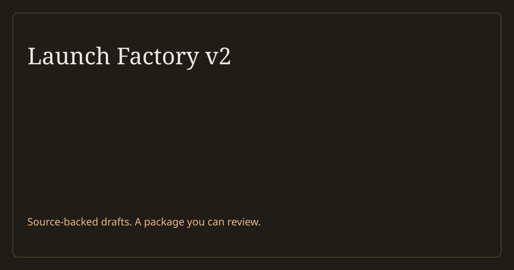

<p align="center"></p>

<p align="center">
<a href="https://github.com/gabchess/launch-factory/releases"></a>
<a href="LICENSE"></a>
<a href="https://github.com/gabchess/launch-factory/actions"></a>
</p>

Launch Factory turns source-backed drafts and footage into a local launch package. Open one page to review the video, writing, animation, and popup, with a two-week campaign plan alongside them.

**The AI agent writes in Codex or Claude Code. Python validates and renders the files. Your team approves them.** Nothing publishes, sends, or schedules.

## See the output

[Download the v2 example package](https://github.com/gabchess/launch-factory/releases/download/v2.0.0/launch-factory-v2-example.zip), [view the review-page screenshot](docs/review-preview.png), or build it from source:

```bash
git clone https://github.com/gabchess/launch-factory.git
cd launch-factory
./run.sh examples/v2-release --example --out runs/v2-example
python3 -m http.server 8768 --bind 127.0.0.1 --directory runs/v2-example
```

Open **http://127.0.0.1:8768**. Requires Python 3.10+ and FFmpeg with the `subtitles` filter. No Python packages or paid API calls are needed to build. On macOS, `brew install ffmpeg` supplies the media tools; on Ubuntu, use `sudo apt install ffmpeg`.

The example uses this project's release notes and a recorded documentation walkthrough. Its output files are real; its approval status is an explicitly labelled rehearsal.

| Output | Files to review |
|---|---|
| Social video | H.264 MP4, up to 30 seconds, with burned-in captions and an SRT file |
| Blog | Markdown, HTML, and an SVG cover |
| Email | Five audience variants in Markdown and HTML |
| Changelog | Versioned Markdown and HTML |
| Login animation | A looping HTML/CSS preview and SVG still, with pause and reduced-motion support |
| In-app popup | SVG graphic, copy, and a dismissible HTML dialog |
| Campaign | Dated two-week CSV and HTML plan, plus LinkedIn, X, and Threads drafts |

## Use your release

Open this repository in your AI coding agent and ask:

> Use Launch Factory v2 on my release folder. Read the source files, prepare the claims for my review, then draft the assets and build a package. Keep the writing short.

The [operator skill](codex/launch-factory/SKILL.md) routes the work to the existing channel specialists. It uses `release.json` to keep copy, source quotes, captions, and the campaign together. [The example](examples/v2-release/release.json) is the input template.

A person checks the claims and records that decision from their own terminal:

```bash
python3 launch_factory.py inspect MY_RELEASE
python3 launch_factory.py lock-claims MY_RELEASE --reviewer "Your name"
./run.sh MY_RELEASE --out runs/my-release-v1
python3 launch_factory.py verify runs/my-release-v1
```

`lock-claims` requires an interactive human response. Agents must stop at that step. The record binds the decision to the claims and source bytes. It is a local operator record, not an authenticated approval service.

After drafting, inspect the actual output and follow [the review checklist](docs/OPERATE-LAUNCH-FACTORY.md). Use a new output folder for each revision.

## What v2 checks

- Source quotes match their files at the stated offsets. Changed sources invalidate Claims Lock.
- Every copy block cites existing claims. Missing channels, segments, footage, or invalid captions stop the build.
- FFmpeg creates and probes the movie. The completed package records hashes for every file.
- A failed build leaves no completed package. Earlier output stays untouched.

These checks do not judge whether a claim supports a paraphrase, whether the writing fits your brand, or whether a video looks and sounds right. A person reviews those decisions.

## Scope

V2 is a local tool for an agent-assisted workflow. Bring readable source files, drafts, timed captions, and footage. It does not transcribe Loom URLs, invent a brand voice, generate actor footage, or operate a hosted app. The login animation is a web component preview; it is not a Lottie export or an installed login-page integration.

No new agent framework was added. The existing specialist protocols cover drafting and review; Python's standard library and FFmpeg cover the build. Optional provider recipes remain separate and require their own access and approval.

## Develop

```bash
python3 -m venv .venv
.venv/bin/pip install -r requirements.txt
.venv/bin/pytest -q
.venv/bin/python scripts/sync_specialists.py --check
```

The tests render and decode a real movie when FFmpeg is installed. They also cover stale sources, missing files, path escapes, failed-build recovery, and modified outputs. [Read the v2 audit](docs/V2-AUDIT.md).

| Path | Purpose |
|---|---|
| `launch_factory.py` | The v2 validator, renderer, and package verifier |
| `examples/v2-release/` | Sources, drafts, and footage for the reproducible example |
| `engine/specialists/` | Channel protocols and source/review checks |
| `codex/launch-factory/` | Canonical operator skill |
| `.agents/`, `.codex/`, `.claude/` | Host entry points |
| `docs/` | Operating guide, audit, and historical decisions |

V2 uses the `v2.0.0` release. The next major update will be v3. Older execution paths remain in Git history. See [CHANGELOG.md](CHANGELOG.md) and [LICENSE](LICENSE).
